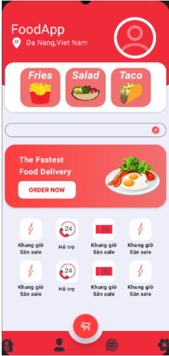
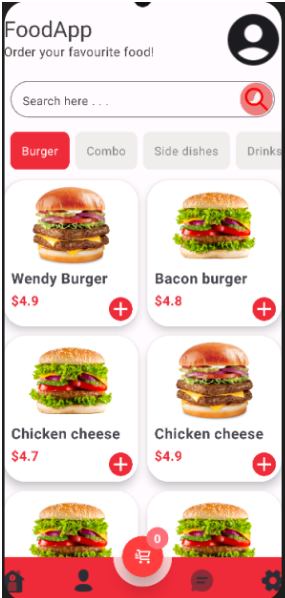
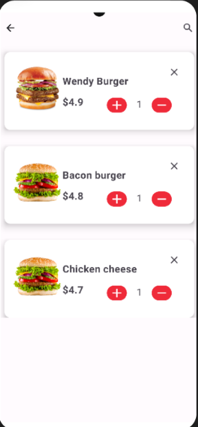
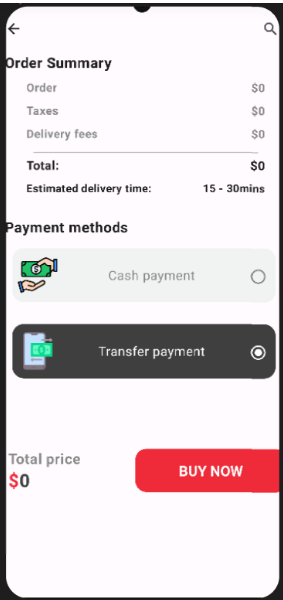
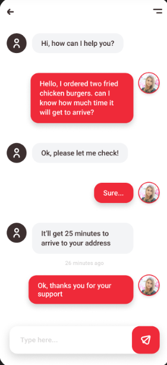
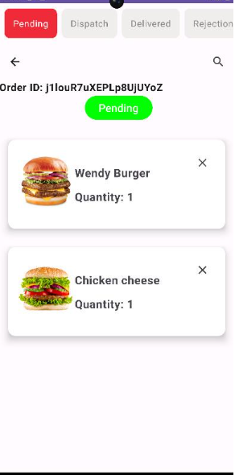

# 🍔 Food Ordering App - Jetpack Compose & Firebase

**Food Ordering App** là một dự án cá nhân được tôi tự thiết kế và phát triển bằng **Jetpack Compose** và **Firebase**.  
Ứng dụng cung cấp trải nghiệm đặt món ăn mượt mà, từ duyệt thực đơn đến thanh toán, với giao diện hiện đại và tương tác thời gian thực.  
Firebase được tích hợp để xử lý xác thực người dùng, lưu trữ dữ liệu và đơn hàng, đảm bảo độ ổn định và bảo mật cao.

---

## 📸 Giao Diện Demo

### 🏠 Giao diện chính & chi tiết





### 🛒 Giỏ hàng & thanh toán




### 💬 Trò chuyện & trạng thái sản phẩm




---

## 🚀 Tính Năng Nổi Bật

- 📋 Duyệt thực đơn và danh mục món ăn
- 🔐 Xác thực người dùng bằng Firebase Auth
- 🛒 Quản lý giỏ hàng: thêm, sửa, xoá món
- 💬 Hỗ trợ trò chuyện với người bán (mock)
- 💳 Thanh toán demo và trạng thái đơn hàng
- ☁️ Dữ liệu được đồng bộ theo thời gian thực với Firebase

---

## 🛠️ Công Nghệ Sử Dụng

- **Jetpack Compose** (UI hiện đại)
- **Kotlin**
- **Firebase**: Auth, Realtime Database
- UI tối ưu cho Android

---

## 👨‍💻 Vai Trò & Trách Nhiệm

- Thiết kế toàn bộ UI với Jetpack Compose
- Kết nối Firebase cho xác thực và lưu trữ dữ liệu
- Quản lý luồng dữ liệu người dùng và đơn hàng
- Xây dựng toàn bộ logic và điều hướng ứng dụng

---

## 🔧 Hướng Dẫn Cài Đặt

```bash
# Clone dự án
git clone git@github.com:phunghao2903/foodapp-kotlin.git

# Mở bằng Android Studio hoặc chạy lệnh sau:
./gradlew assembleDebug

# Cấu hình Firebase:
# - Tạo project Firebase mới
# - Thêm file google-services.json vào thư mục /app
# - Kích hoạt Authentication và Realtime Database trên Firebase Console

